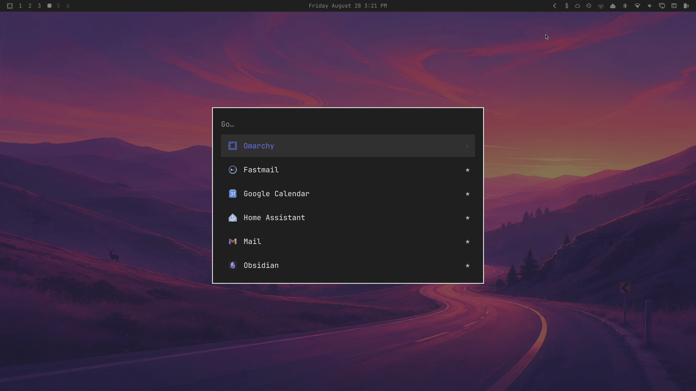
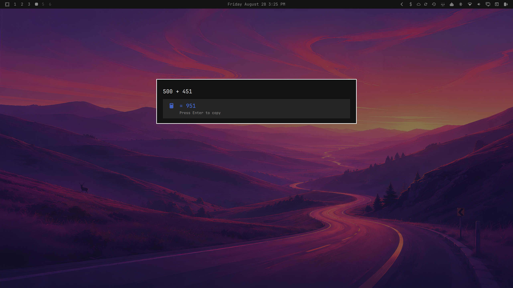
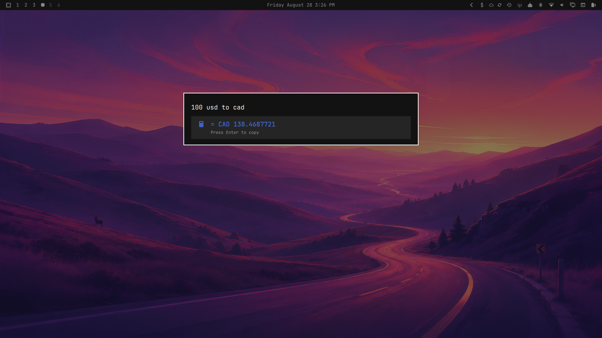
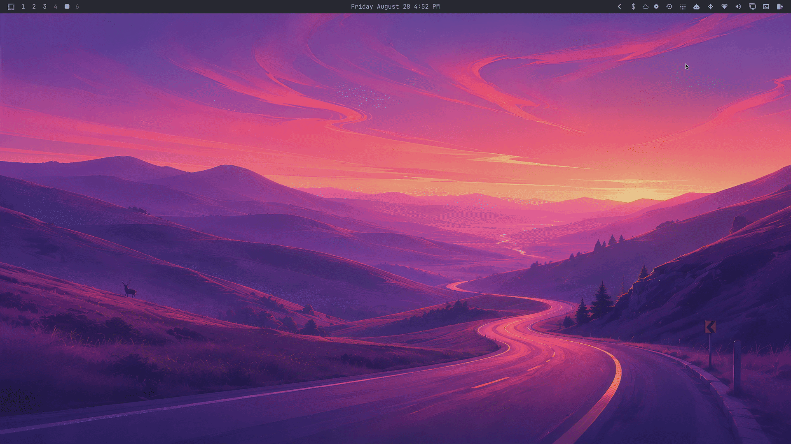

# Omalaunch

An extensible command launcher for [Omarchy](https://omarchy.org/).

Omalaunch keeps the familiar Omarchy command tree while adding fast global search, application results, favorites, usage-aware ranking, calculations and conversions, and independently installable extensions.



## Installation

### From the Omarchy menu

1. Open **Setup › Plugins › Add Plugin**.
2. Enter `https://github.com/daniellemky/omalaunch` as the Git URL.
3. Review and confirm Omarchy’s plugin trust warning.
4. Confirm that you want to enable Omalaunch.
5. Choose **left** when prompted for a bar section.

### From a terminal

```bash
omarchy plugin add https://github.com/daniellemky/omalaunch --enable
```

Review and confirm the plugin trust warning, then choose **left** when prompted for a bar section.

Enabling Omalaunch replaces Omarchy’s default clickable launcher icon and routes the existing Super+Space shortcut to Omalaunch. Disabling or removing the plugin restores the default Omarchy launcher. No calculation dependency needs to be installed before adding the plugin; Omalaunch offers explicit setup from its starting view when needed.

Click the launcher icon or press Super+Space to open Omalaunch. Right-clicking the icon opens a terminal.

Current Omarchy versions can select a bar section during installation but not an exact index. If the launcher icon appears after the workspace buttons, move it to the first position with:

```bash
omarchy bar move quantumfire.omalaunch --section left --index 0
```

This workaround can be removed once Omarchy supports setting a widget’s section and index during plugin installation.

## Features

- Search the complete Omarchy command tree and installed applications
- Star favorites and rank frequently used results
- Run arithmetic, unit conversions, and currency conversions with `qalc`
- Copy calculation results directly to the clipboard
- Browse, recursively search, open, copy paths, and star local files and directories
- Look up current times and convert times across DST-aware timezones
- Accept dmenu-style select and input requests
- Load extensions contributed by enabled Omarchy plugins
- Launch agent prompts such as Pi and Codex through optional extensions

## Starred favorites

Star frequently used applications, commands, files, directories, and extension shortcuts on the launcher’s starting view. Matching starred items rank above unstarred search results, and starred files and directories are searchable by name or path.


## Calculator

Evaluate arithmetic, units, and currency conversions without leaving the launcher. Press Enter to copy the result.



## Currency conversion

Convert currencies inline using `qalc` exchange-rate data. Press Enter to copy the result.



## Timezones

Type `time` to select the bundled Timezone extension. Look up the current time with queries such as `time seattle` or convert a specific time with `time 9am winnipeg to tokyo`. Dates are optional, city aliases and IANA timezone names are supported, and conversions account for daylight-saving time.

```text
time seattle
time 9am winnipeg to tokyo
time 2026-11-15 8pm new york to london
```

## Files

Type `files` and activate the **Files** result to browse from your home directory. Select folders to navigate, type to search recursively within the current folder, and select a file to open it with the default application. Supported image files show thumbnails in the result list and a larger preview pane when selected. Directory contents are ordered by most recently modified, while search uses `fd` with fzf's path-aware relevance ranking. A short-lived per-directory index is reused while typing so each query does not traverse the filesystem again. Hidden and ignored files are excluded.

Press Ctrl+K on a selected item to open its Action Panel. Directories can be opened in Files or a terminal, while files can be opened with their default application. Files and directories can also be starred for the launcher’s starting view from the Action Panel or directly with Ctrl+S. Every item supports copying its path or copying the item to the file clipboard. Ctrl+C remains a shortcut for copying the selected path.



## Requirements

- A current Omarchy installation with the manifest-based shell plugin system
- [`libqalculate`](https://qalculate.github.io/) (`qalc`) to enable calculations and conversions
- `fd`, `fzf`, `jq`, Python 3, Bash, and `wl-clipboard` (provided by a standard Omarchy installation; Python drives extension loading and file indexing)

Install the calculation dependency through Omarchy:

```bash
omarchy pkg add libqalculate
```

If it is missing, the launcher’s starting view shows **Enable Calculator & Currency**. Press Enter to review the exact command and explicitly confirm opening it in a visible terminal. The same setup remains available from unavailable calculation results. Reopen Omalaunch afterward to recheck the dependency; no shell restart is required. All unrelated launcher features remain usable.

Omalaunch never installs system packages silently. Package installation is offered only for dependencies allow-listed by Omalaunch itself; external extensions cannot supply installation commands.

## Usage

Start typing to search commands and applications. Use the arrow keys or Tab and Shift+Tab to move, Enter to activate, and Escape to go back or close the launcher.

Examples:

```text
10 USD to CAD
25 * 4
browser
wifi
files
```

Calculation results appear first and are copied to the clipboard when activated.

### Extensions

Open the fixed top-level **Extensions** directory to find every active bundled and external extension, including Calculator, Currency conversion, Files, Timezone, and installed workflow integrations such as Codex. Star an extension with Ctrl+S to add the same shortcut to the starting view; it remains in **Extensions**, where starred shortcuts sort first and all others sort alphabetically. The directory itself cannot be starred. Global search finds extension shortcuts whether or not they are starred.

Shortcut activation follows the extension type: Files opens its browser, Timezone prepares its prefix, Calculator and Currency conversion open focused query input, and workflow extensions open their workflow. A replacement provider keeps the same shortcut and favorite because identity is based on stable capability rather than provider id. Missing dependencies are shown on the shortcut without affecting unrelated extensions.

Omalaunch includes replaceable bundled extensions. Every external Omalaunch extension is simply a standard Omarchy plugin, so it uses the same installation, enable/disable, update, and removal workflow as any other Omarchy plugin.

Install an extension directly from its repository:

```bash
omarchy plugin add https://github.com/example/omalaunch-example --enable
```

Once enabled, Omalaunch discovers it automatically through the plugin manifest:

```json
"omalaunch": {
  "extensions": ["omalaunch.json"]
}
```

Browse available integrations in the [Omalaunch Extension Directory](https://github.com/DanielLemky/omalaunch-extensions). Each extension repository contains its exact installation command. See [EXTENSIONS.md](EXTENSIONS.md) for the complete extension contract and examples.

## Configuration

Omalaunch reads the stock Omarchy menu and the standard user menu override:

```text
~/.config/omarchy/extensions/omarchy-menu.jsonc
```

Favorites and usage data are stored in the user's state directory. Currency refreshes use `qalc` and respect a persistent cooldown to avoid unnecessary network requests.

## Updating

```bash
omarchy plugin update quantumfire.omalaunch --yes
omarchy restart shell
```

The `--yes` flag skips the interactive diff review; omit it if you prefer to review and confirm every incoming change. Restart the shell after updating so the running QML engine does not continue
using cached plugin code. This works around an upstream Omarchy hot-reload
issue until plugin rescans reliably load changed QML. The restart reloads
Omalaunch code and is unrelated to calculation dependencies; installing
`libqalculate` requires only reopening Omalaunch to recheck it.

## Disabling and removal

Disable or re-enable Omalaunch without removing it:

```bash
omarchy plugin disable quantumfire.omalaunch
omarchy plugin enable quantumfire.omalaunch
```

Remove it completely:

```bash
omarchy plugin remove quantumfire.omalaunch
```

Disabling or removing Omalaunch restores the stock launcher. Removing Omalaunch does not remove its optional extension plugins, saved state, or system dependencies.

## Security

Omarchy plugins are unsandboxed and run with the current user's permissions. Install plugins only from sources you trust.

Omalaunch executes commands supplied by the stock menu, user menu configuration, and enabled extension plugins. Extension commands are represented as argument arrays; Omalaunch substitutes the prompt and shell-quotes each argument. Dependency installation is never performed silently.

Currency conversion may cause `qalc` to retrieve updated exchange-rate data from its configured upstream source.

## Development

Run the tests with:

```bash
node tests/menu-model-test.js
bash tests/manifest-test.sh
bash tests/qalc-integration-test.sh
bash tests/timezone-integration-test.sh
python tests/file-index-integration-test.py
```

The integration test requires `qalc`.

Release maintainers should follow [`RELEASING.md`](RELEASING.md). Omarchy updates
plugins from the default branch, so `master` remains stable while version tags
and GitHub releases provide immutable reference and rollback points.

## Acknowledgements

Omalaunch began as a customization of Omarchy's built-in menu and continues to consume Omarchy's standard menu definitions and shell APIs.

## License

[MIT](LICENSE) © Daniel Lemky
